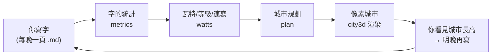
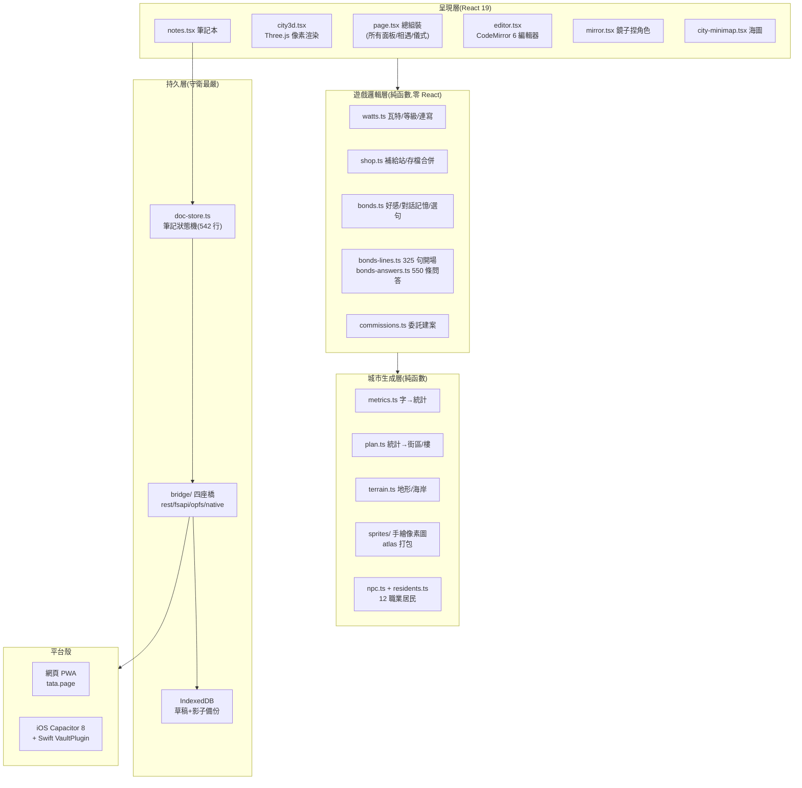
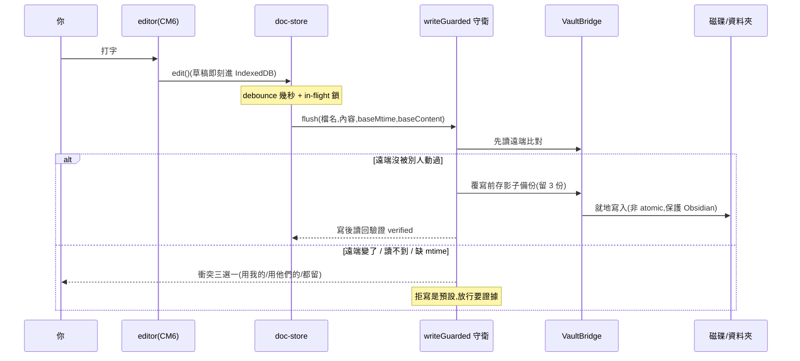
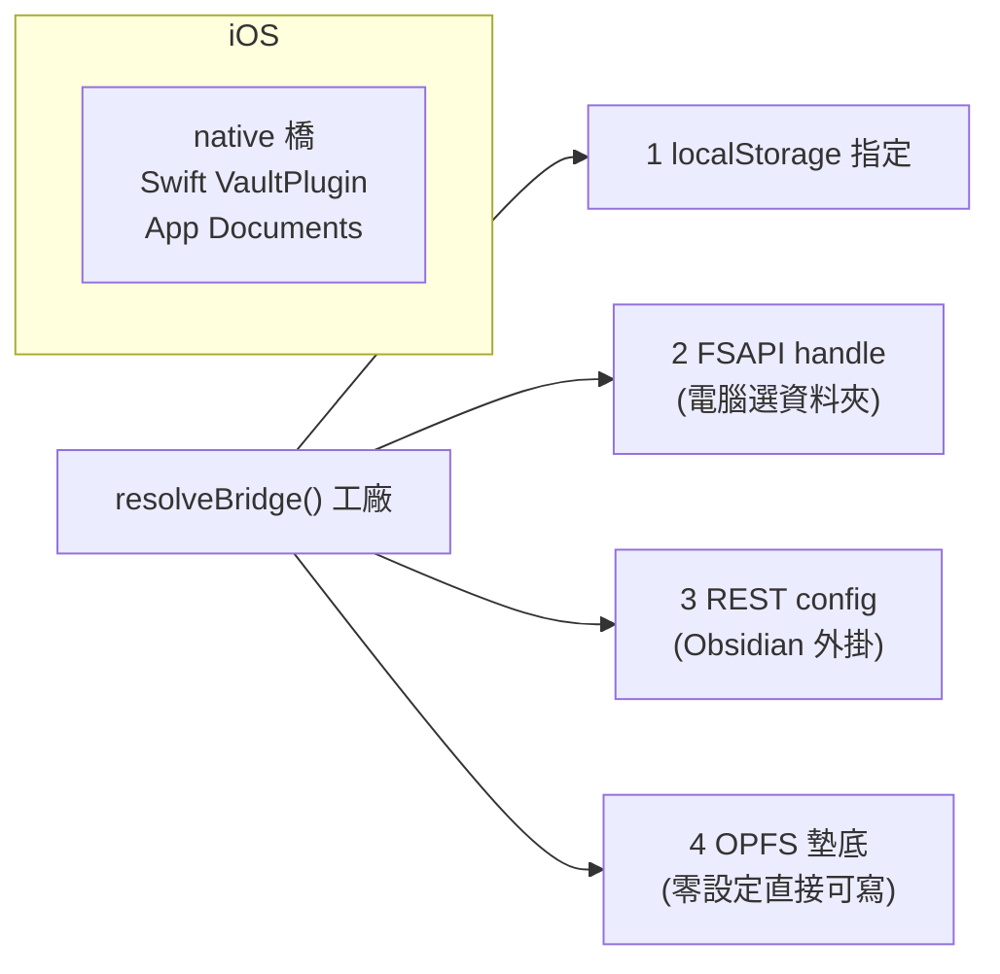
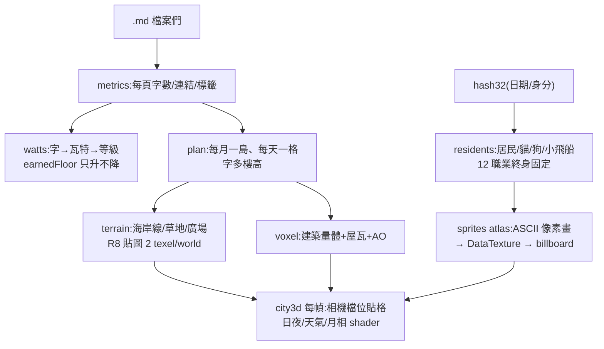
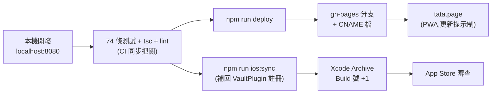

# Tata 完整施工架構圖

> 一張圖看懂整個系統怎麼蓋的。圖用 mermaid 畫,在 Obsidian 或 GitHub 上直接看得到;細節表格在圖下方。
> 姊妹檔:[wireframe.md](wireframe.md)(畫面長相)、[維護迴圈.md](維護迴圈.md)(怎麼養)、[資安守護.md](資安守護.md)(怎麼守)。

## 0. 一句話架構

**你寫的字(.md 檔)是唯一的真相來源;城市、瓦特、居民全部是從字「推導」出來的,壞了隨時可以重算。**

## 1. 五層分工

| 層 | 鐵律 |
|---|---|
| 呈現層 | 只組裝、不算帳;所有可算的東西都推導,不存第二份 |
| 遊戲層 | 純函數 + 可交換合併(merge 兩台裝置怎麼排列結果都一樣) |
| 城市層 | 同一份筆記永遠長出同一座城(確定性雜湊,無隨機) |
| 持久層 | **缺欄位一律拒寫**;讀不到要拋錯,不准回 null 裝作不存在 |
| 殼層 | 零伺服器;每個平台只是「字放哪裡」不同 |

## 2. 一頁筆記的旅程(寫入路)

**守衛鏈(由外到內)**:草稿先落地 → 樂觀鎖比對 → 影子備份 → 就地寫 → 寫後驗證 → 驗證失敗不刪草稿。筆記與 `tata.json`(遊戲存檔)各有守衛:筆記走 `writeGuarded`,存檔走 `decideVaultWrite`(未載入/讀壞一律拒寫、遠端較新先 merge)。

## 3. 四座橋(字要住在哪裡)

四座橋實作同一個 `FileStore` 三方法介面(read / write / list),共用同一顆守衛腦 `buildFsBridge()`——**守衛只寫一次,每座橋自動繼承**。iCloud 資料夾橋(security-scoped bookmark)程式碼已完成、v1 以開關 `FOLDER_PICKING_SHIPPED=false` 收起,真機驗證完即 v1.1。

## 4. 城市怎麼長出來(推導路)

- **確定性**:居民身分 = `hash32("kind:i")`,今天誰請託 = `hash32(日期+":favour")`——換裝置重算,結果一致,所以什麼都不用存。
- **小物件鐵則**:小於 2 世界單位的東西(樹、居民、街邊小物)一律手繪 sprite,盒子拼裝在 12px 尺度永遠不像。
- **不懲罰鐵則**:earnedFloor 單調(刪筆記城市不縮)、街燈記歷史最佳連寫(斷更不滅)。

## 5. 部署管線

## 6. 產品鐵律(所有工程決策的上游)

1. **三色**:黑・白・琥珀,僅此三色;琥珀永不販售。
2. **全像素**:像素感來自「畫出來的結構」,不是 CSS 妝點。
3. **不要說明文**:用居民和設計教學,不放教學文字。
4. **不懲罰**:斷更不倒扣、刪字不縮城、過去頁定稿唯讀。
5. **花瓦特必須看得見**:買了看不到的東西,不如收掉。
6. **字勝過家具**:新樓永遠優先,擺飾自動讓路。
7. **示範城市絕不寫真存檔**。
