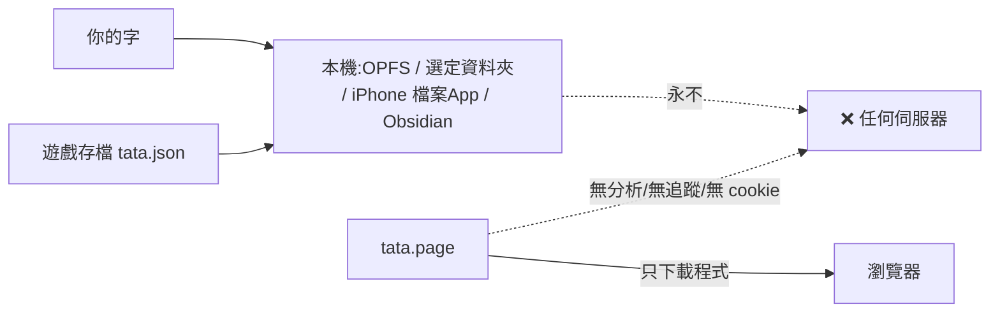

# Tata 資安守護

> Tata 的安全哲學只有一句:**最不會外洩的資料,是從來沒離開過你機器的資料。**
> 這份文件列出威脅模型、每一道防線、以及維護時不可破的紅線。

## 0. 威脅模型(我們在防什麼)

| 威脅 | Tata 的處境 |
|---|---|
| 伺服器被駭/資料庫外洩 | **不存在**——零伺服器、零資料庫、零帳號系統 |
| 日記內容外洩 | 字只存在使用者本機/自選資料夾,永不上傳 |
| 使用者的字被 app 自己弄丟 | **最真實的威脅**(8/21 事故),防線最厚 |
| 供應鏈(npm 套件)投毒 | 依賴極少(react/three/vite 核心),CI+lockfile 把關 |
| 同源網站偷金鑰 | 已用自訂網域 tata.page 隔離 origin |

## 1. 隱私:資料流向圖

- **不收集資料**:無登入、無遙測、無第三方 SDK、無廣告;App Store 隱私聲明=「不收集資料」,而且是真的。
- REST 金鑰(Obsidian 外掛路線)只存 localStorage,只在本機 127.0.0.1 使用。
- 診斷日誌(debuglog 環)只留在記憶體/本機,由使用者自己決定要不要截圖給誰。

## 2. 防「弄丟使用者的字」(最厚的一層)

這一層的鐵律,每一條背後都是真事故:

1. **缺欄位一律拒寫**——樂觀鎖任何「讀不到 mtime/內容」的分支,預設是拒寫不是放行(8/21:mtime null 繞過守衛直接覆蓋)。
2. **讀不到 ≠ 不存在**——`FileStore.read()` 回 null 只准代表「證實不存在」,失敗必須拋錯(iCloud 未下載 stub 讓這從理論變現實)。
3. **覆寫前先影子**——每次覆寫前存影子備份(IndexedDB,每檔 3 份)。
4. **墓碑先立,原稿才准死**——衝突選「用他們的」時,我方版本先存成 `xxx (tata HH.MM).md`。
5. **寫後驗證**——寫完讀回比對;`verified:false` 不刪草稿。
6. **就地寫、非 atomic**——atomic rename 在別人的 vault 裡等於刪除+新建,會弄壞 Obsidian 分頁與 iCloud 版本史。
7. **單一寫入通道**——`write` 私有化,所有路徑必經守衛;`list` 失敗必 reject 絕不回空陣列(空陣列=城市清空+每頁可自由覆寫)。

## 3. 網頁前線

| 防線 | 狀態 |
|---|---|
| 自訂網域 origin 隔離 | ✅ tata.page(github.io 專案頁共用 origin,金鑰會被同帳號其他頁讀到——已遷離) |
| HTTPS 強制 | ✅ `https_enforced:true`,DNS 灰雲直連 GitHub Pages |
| CNAME 防抖 | ✅ public/CNAME 隨每次 deploy(少了它網域會被 gh-pages 抖掉) |
| PWA 更新 | 提示制(不強制換版);SW 混載 chunk 曾造成 IME 異常,已有組字守衛 |
| 外部連結 | 全 app 僅兩個(obsidian.md 官方);不載入任何第三方資源 |

## 4. iOS 前線

- **沙盒**:字存 App Documents(檔案 App 可見、使用者可自行備份)。
- **Security-scoped bookmark**(iCloud 資料夾,v1.1):解析失敗**絕不刪書籤**(重開機時 file provider 可能未起),退避重試;打不開回 `needsPick` 且不給橋——靜默退回自家 Documents 會開出第二個保管庫。
- 引導選 vault **子資料夾**(`Vault/Tata/`),把與 Obsidian 併寫的機率壓到近零。
- `ITSAppUsesNonExemptEncryption=false` 已宣告(只用系統 HTTPS)。

## 5. 供應鏈與倉庫紀律

| 紅線 | 說明 |
|---|---|
| 金鑰不進 repo | repo 是公開的;appstore 素材資料夾已 gitignore;任何 token/憑證永不 commit |
| lockfile 必 commit | 依賴版本鎖死,CI 用同一份 |
| 每月 `npm audit` | 見[維護迴圈.md](維護迴圈.md)健檢節 |
| 不執行來源不明指令/網址 | 特別是帶 token 參數的(使用者全域安全規則) |
| 改設定檔前先備份 | 備份到 ~/Claude/backups |

## 6. 給維護者的三句話

1. 動儲存層之前,先跑 `fs-bridge.test.ts` 的 "unreadable is not absent" 區塊,讀懂為什麼。
2. 任何新的「讀取失敗」分支,問自己:這會不會讓守衛以為檔案不存在?
3. 想加任何會把資料送出本機的功能(同步、分析、雲端),答案預設是**不加**——那是產品轉向,不是功能。
